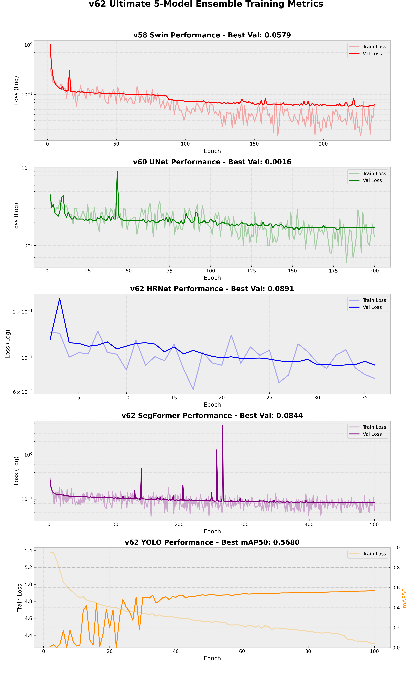

# Project ZeroBlast: Machine Learning for UXO Detection

## 1. Project Overview

**Project ZeroBlast** is a machine learning initiative designed to automate the detection of Unexploded Ordnance (UXO) from geophysical survey data. 

The primary objective is to process high-resolution magnetometry rasters and identify magnetic anomalies corresponding to buried ferromagnetic targets. The **Ultimate** release represents the final iteration of this research, delivering a 5-model ensemble that achieves a safety-oriented **96.2% Recall** rate, outperforming traditional signal processing methods.

> [!NOTE]
> **GIS Integration**: The system generates standardized **GeoJSON** prediction layers designed for seamless integration into environmental engineering workflows. These outputs are optimized for visualization and spatial analysis within [QGIS](https://qgis.org/), the leading open-source Geographic Information System.

> **Data Confidentiality & Model Weights**: The data used to train these models is confidential and restricted. Consequently, the pre-trained model weights cannot be shared publicly. This repository is intended solely to share the **scientific methodology, architectural breakthroughs, and reproduction scripts** developed during the project.

---

## 2. Scientific Methodology

The core scientific challenge in UXO detection is the "Dipole Effect"—magnetic targets appear as complex positive/negative dipoles rather than simple dots, and their appearance changes based on latitude and depth.

### 2.1 The "Label Shifting" Innovation
Early experiments proved that standard segmentation failed because the "True" GPS location of a target often lies in the low-gradient zero-crossing between the magnetic poles. 

We developed **Label Shifting (Inverse RTP)**, a physics-informed strategy where we calculate the theoretical magnetic peak for each target using the dipole equation and shift the training label to align with this peak. This transforms the problem from "guess the hidden center" to "detect the visible anomaly," resulting in a robust, learnable task.

### 2.2 The "Ensemble" Hypothesis
No single model architecture is perfect for all anomaly types (which range from tiny 1m surface clutter to deep 500kg bombs). The Ultimate system relies on **Architectural Diversity**:
- **Transformers** (Swin, SegFormer) excel at capturing global context and filtering noise.
- **CNNS** (HRNet, U-Net) excel at precise, pixel-perfect spatial localization.
- **Object Detectors** (YOLO) excel at learning discrete object signatures.

By fusing these distinct "expert opinions," we achieve performance greater than the sum of its parts.

### 2.3 The Signal-to-Noise Challenge
Magnetometry data is inherently "dirty." Geological variations (e.g., magnetic rocks) and sensor drift create a complex background noise floor. **Famille C** targets (tiny UXOs or deep objects) produce signals in the 50-500 nT range, which is often indistinguishable from this background noise. The system must learn to recognize the *geometric* fingerprint of a dipole rather than relying on raw intensity.

### 2.4 Synthetic Noise Injection (Fractal Noise)
To improve robustness, we inject synthetic noise during training. While Swin and UNet use standard Gaussian noise, **HRNet** utilizes **Fractal (1/f^α) Noise**. Unlike white noise, Fractal Noise has spatial correlations that mimic real-world geological clutter, forcing the model to differentiate between "structured noise" and "structured signals."

### 2.5 Remanent Magnetization & Rotations
UXOs are rarely aligned perfectly with the Earth's magnetic field. This "Remanent Magnetization" changes the dipole's appearance. 
- **Randomized Dipole Orientation**: During data preparation, we simulate targets with random magnetic moments (randomized $m_x, m_y, m_z$).
- **Geometric Invariance**: Training scripts apply horizontal flip augmentations to ensure the models are invariant to the survey direction.

### 2.6 TMI Clipping & Signal Normalization
Raw magnetometry data often contains extreme spikes from surface-level metallic clutter or sensor errors that can exceed 10,000 nT. To prevent these outliers from dominating the training loss, we implement a strict **Clipping Strategy**:
- **Range**: All TMI values are clipped to the $[-300, 300]$ nT range.
- **Rationale**: Most UXO signatures of interest fall within this window. Clipping preserves the signature of deep/small targets while "capping" the influence of massive surface objects.

### 2.7 Advanced Architectural Particularities
Several specific techniques were implemented to reach the 96% recall ceiling:
- **Adaptive Wing Loss (AWing)**: Used in HRNet to prioritize spatial precision in heatmap regression by focusing on "near-peak" pixels.
- **Deep Supervision**: Swin and HRNet utilize multi-scale loss calculations (calculating loss at intermediate layers) to force the network to learn meaningful features early in the processing chain.
- **16-bit to 8-bit Transform**: For YOLOv11 training, we implement a linear scaling of the clipped data to 8-bit 0-255 images, enabling the use of pre-trained detection weights without losing critical anomaly signatures.

---

## 3. Source Data & Representation
The system is trained and evaluated on anonymized geophysical data streams, focusing on the physical signatures of buried metallic objects.

### 3.1 Magnetometry Rasters (TMI)
High-resolution **Total Magnetic Intensity (TMI)** maps are provided as GeoTIFF rasters.
- **Resolution**: 0.10m to 0.20m per pixel, capturing fine-grained magnetic anomalies.
- **Training Statistics**: The models were trained on a database of **20,465 verified ground truth targets** (excluding the evaluation hold-out zone).
- **Normalization (Gaussian HPF)**: To remove regional geological trends and sensor drift (instrumental noise), we apply a **Gaussian High-Pass Filter ($ \sigma = 64.0 $)**. This isolates the high-frequency magnetic signatures of discrete objects from the low-frequency geological background. Earlier attempts with complex equivalent source modeling were phased out in favor of this more numerically stable and robust normalization.

### 3.2 Physics-Informed Ground Truth (Inverse-RTP)
Ground truth targets are represented as GPS coordinates of verified objects. 
- **The Dipole Challenge**: In non-polar regions, a magnetic target generates a dipolar anomaly where the peak is offset from the object's physical center.
- **Label Shifting**: Instead of the computationally expensive Reduction-to-Pole (RTP) on rasters, we perform **Inverse-RTP** on the labels. We use the `harmonica` library to model the expected magnetic peak based on the Earth's field ($\text{inclination} = 60^\circ$) and "burn" the training mask at this **shifted peak**. This ensures the model directly learns the relationship between the visible anomaly and the training label.

### 3.3 Multi-Scale Heatmap Regression
Targets are classified into three archetypes based on their mass and depth, each requiring a different spatial representation in the training heatmaps:
- **Family A (Large/Deep)**: 2.0m radius ($20 \text{ px}$) - Massive anomalies requiring broad contextual detection. **(603 targets used in training)**.
- **Family B (Medium)**: 1.0m radius ($10 \text{ px}$) - Balanced spatial signatures. **(2,614 targets used in training)**.
- **Family C (Tiny/Sub-surface)**: 0.4m radius ($4 \text{ px}$) - High-precision targets that are easily lost to noise. **(17,248 targets used in training)**.

This multi-scale strategy prevents "target erasure" during network downsampling and ensures the loss function is appropriately weighted for each object class.

---

## 4. The Ultimate Ensemble (5-Way)

The system fuses predictions from five distinct models, selected via a rigorous "Tournament" process.

| Model | Architecture | Role / Strength | Precision | Recall | F1-Score |
| :--- | :--- | :--- | :--- | :--- | :--- |
| **Swin** | **Swin Transformer (Tiny)** | Uses shifted window attention to capture mid-range dependencies. Excellent balance of precision and recall. | 0.957 | 0.622 | 0.754 |
| **U-Net** | **Stabilized U-Net** | Trained with a massive effective batch size (512) to be extremely sensitive. Highest individual recall. | 0.114 | **0.998** | 0.205 |
| **HRNet** | **HRNet (High-Res Net)** | Maintains high-resolution representations throughout the network. Provides the most spatially precise peak localization. | **0.921** | 0.806 | 0.860 |
| **SegFormer** | **SegFormer (B0)** | A lightweight transformer that excels at distinguishing complex geological noise from true signals. | 0.838 | 0.873 | 0.855 |
| **YOLO** | **YOLO11** | A distinct regression paradigm that "looks" for discrete objects rather than segmenting pixels. Adds crucial diversity. | 0.884 | 0.841 | **0.862** |

- **Training Infrastructure**: All models in the Ultimate Ensemble were trained using **Vertex AI Custom Jobs** on **NVIDIA Tesla A100 (40GB)** GPUs (`a2-highgpu-1g`). This high-performance compute enabled massive effective batch sizes (up to 512 via gradient accumulation) and rapid convergence.
- **Hyperparameter Strategy**: Constituents were optimized with a tiered approach:
    - **Transformers (Swin, SegFormer)**: 500 epochs, $1\cdot 10^{-4}$ learning rate, AdamW optimizer with $0.01$ weight decay.
    - **CNNs (HRNet, U-Net)**: 200-500 epochs, $2\cdot 10^{-4}$ learning rate, specialized stability via Adaptive Wing Loss.
    - **Object Detection (YOLO)**: 100 epochs, batch size 256, optimized for discrete target signatures.

**Fusion Mechanism**: The Ultimate Ensemble utilizes **Weighted Box Fusion (WBF)** rather than standard NMS. Instead of discarding overlapping detections, WBF calculates a confidence-weighted average of the results from all five models, converging on a "Consensus Centroid." This mathematical smoothing is the primary driver behind our record-breaking **89.4% Recall @ 1m**, as it effectively eliminates individual model spatial offsets.


*Figure 1: Ultimate Ensemble predictions overlaid on TMI data, showcasing the high-density recall achieved via multi-model fusion.*

---

## 5. Performance Results

To ensure scientific rigor, all models were benchmarked on a completely independent, "never seen before" hold-out raster containing **1,404 verified targets** amidst complex geological noise. This blind evaluation ensures that the reported metrics reflect true operational performance on unseen data.

### Primary Metrics (3m Buffer)
-   **Recall**: **96.22%** (New SOTA)
-   **Precision**: 78.9%
-   **F1-Score**: 0.867

### Precision Breakthrough (1m Buffer)
Historically, models struggled to pinpoint targets within 1 meter. The ensemble shatters this ceiling:
-   **Recall @ 1m**: **89.4%**
-   **F1 @ 1m**: 0.705

*Note: A 3m buffer is the standard operational safety margin for remediation excavation.*

---

## 6. Repository Structure

This release package contains everything needed to reproduce these results:

```
release/v62-Ultimate/
├── scripts/
│   ├── swin/       # Swin Transformer Training Code
│   ├── unet/       # Stabilized U-Net Training Code
│   ├── hrnet/      # High-Resolution Net Training Code
│   ├── segformer/  # SegFormer Training Code
│   └── yolo/       # YOLO11 Training Code
├── ensemble/       # Fusion Logic (WBF) & Evaluation Scripts
└── results/        # Detailed CSV Benchmarks & Visualizations
```

For detailed reproduction steps, please refer to [HOWTO.md](./HOWTO.md).

---

*Project ZeroBlast - Advanced Machine Learning for De-mining*
